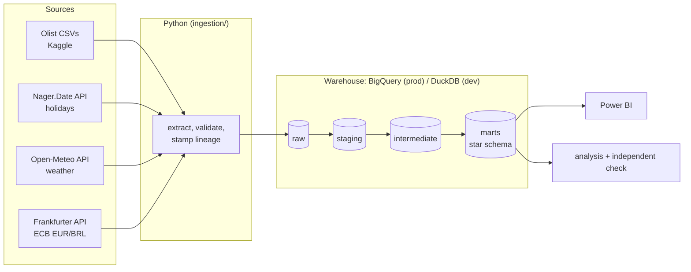

# Delivery Promise Analytics: revenue at risk from late e-commerce deliveries

An end-to-end analytics pipeline on 99,441 real orders from Olist, a Brazilian e-commerce platform
that connects small sellers to the big online marketplaces. It brings in public holidays, weather and ECB exchange rates from public APIs, models everything in a
cloud warehouse with tested SQL (dbt), and finds out where late deliveries come from and how much
revenue they put at risk.


## Results (orders Jan 2017 - Aug 2018)

- **6.8% of delivered orders arrive after the promised date**, even though Olist promises about twice
  the actual delivery time (24.3 vs. 12.5 days on average).
- **EUR 264k of revenue is at risk (6.6% of GMV):** late orders rated 1-2 stars (EUR 183k) plus orders
  never delivered after their promised date (EUR 81k).
- **Lateness destroys satisfaction.** Late orders average 2.3 stars (on time: 4.3), and 62% are rated 1-2 stars.
  Even 1-2 days late nearly triples the share of 1-2 star reviews.
- **72% of late orders were handed to the carrier on time.** The delay happened in transit, on specific routes.
- **When a seller misses its hand-over deadline, the order is late 4 times as often** (21% vs. 5%). The
  seller's delay adds 7.3 days, but the customer's promise does not move.
- **One route, Sao Paulo -> Rio de Janeiro, carries 17% of the revenue at risk** with 8.5% of delivered
  orders (14% late). The Northeast is late 12.8% of the time, the Southeast 6.1%.
- **Paying by boleto (bank slip) adds about a day** for payment clearing, and the customer's promise
  ignores it. Olist's own seller deadline starts when payment clears (79% of deadlines are exactly
  N days after approval), but the customer's promise starts at purchase.
- **Rain and holidays matter much less than they first appear.** Rain looks like +5 points of lateness,
  but it is +1.2 once you compare orders to the same state in the same week. Holidays add 0.3 days,
  and the promise already allows 1.3.


### Recommendations

1. **Enforce the seller hand-over deadline** (8.9% of orders miss it), starting with the 54 watchlist
   sellers. They handle 4.4% of revenue but 9.2% of revenue at risk. When a deadline is missed, update the
   customer's delivery date straight away.
2. **Fix Sao Paulo -> Rio de Janeiro first**, then the Sao Paulo -> Northeast routes: the top 10 routes
   hold 60% of the revenue at risk.
3. **Start the delivery promise when payment clears**, so boleto customers are not promised a day
   the process cannot deliver.
4. **Add a buffer for peak periods.** Late rates reached 12-19% in Nov 2017 and Feb-Mar 2018, which no
   fixed formula absorbs.
5. **Investigate the 1,699 orders that never arrived** (EUR 81k): lost parcels or missing delivery
   scans. 76% of those customers left 1-2 stars.

Not recommended: replacing the promise formula. Back-tested on 2018 orders, promises based on each
route's past delivery times performed about the same as Olist's own
([decision 014](docs/decisions.md)).

Full numbers: [docs/results/02_findings.md](docs/results/02_findings.md). The stage-by-stage story:
[docs/WALKTHROUGH.md](docs/WALKTHROUGH.md).

## Architecture



| Layer | What happens | Where |
|---|---|---|
| Extract | Download Olist; call 3 public APIs with retries, validation and lineage fields | `ingestion/` |
| Load | Land files unchanged in the `raw` schema, all CSV columns as text, row counts checked | `ingestion/load_*.py` |
| Staging | Types, clear names, one model per source table | `dbt/models/staging/` |
| Intermediate | Business rules: delivery outcome, stage timings, latest review, EUR rates, holidays and rain per order | `dbt/models/intermediate/` |
| Marts | Star schema (`fct_orders`, `fct_order_items`, 4 dimensions) plus route, seller, monthly and driver tables | `dbt/models/marts/` |
| Analysis | Findings, charts, promise back-test, independent recomputation in pandas | `analysis/` |
| Dashboard | Power BI on the marts | `powerbi/` |

SQL techniques used: CTEs throughout, window functions (`row_number` for de-duplication,
`last_value ... ignore nulls` to carry exchange rates over weekends, rolling 3-month rates, `lag`,
`rank` and `percent_rank`, cumulative Pareto shares), range joins, Jinja-generated SQL and
warehouse-specific macros.

## Quality checks

- **96 dbt data tests:** keys unique and not null, relationships between tables, accepted values and
  ranges, and reconciliations (e.g. GMV in the fact table equals the raw file to the cent).
- **3 dbt unit tests** pin down the business rules with hand-made examples: delivered on the promised
  day = on time; weekend exchange rate = Friday's; latest review wins.
- **23 Python unit tests** for the extractors and loaders (offline).
- **Independent verification:** `analysis/verify.py` recomputes 10 headline numbers from the raw files
  with pandas, without any SQL. All 10 match the warehouse exactly.
- **Two warehouses, one answer:** the same dbt project runs on DuckDB and on BigQuery (EU). Headline
  numbers, driver effects and route rankings are identical on both.
- **CI:** every push runs lint, tests and the whole pipeline from scratch on GitHub Actions.

## Run it

Requires [uv](https://docs.astral.sh/uv/).

```bash
uv sync                               # Python 3.12 + exact library versions from uv.lock
uv run python run_pipeline.py         # download, APIs, load, dbt build + tests, analysis, checks (~2 min)
```

Cloud warehouse: log in once with `gcloud auth application-default login`, set `GCP_PROJECT_ID`,
then run `uv run python run_pipeline.py --bigquery`. Dashboard: [powerbi/DASHBOARD_GUIDE.md](powerbi/DASHBOARD_GUIDE.md).

## Limitations

- Brazilian data from 2016-2018. The methods transfer to any marketplace; the numbers do not.
- Olist records one delivery date per order, so multi-seller orders share one outcome.
- Weather is measured at each state capital, not the customer's city.
- Driver effects compare like with like (same state, same week). They are not a causal model.
- The public holiday API lists only one state-level holiday for Brazil, so holidays are mostly national.

## Data sources and attribution

- Olist, [Brazilian E-Commerce Public Dataset](https://www.kaggle.com/datasets/olistbr/brazilian-ecommerce), CC BY-NC-SA 4.0
- [Nager.Date](https://date.nager.at): public holidays
- [Open-Meteo](https://open-meteo.com): historical weather, CC BY 4.0
- [Frankfurter](https://frankfurter.dev): European Central Bank reference rates

## How this was built

<!-- Owner: check this paragraph is accurate before publishing. -->
Built with Claude Code, an AI coding assistant, which wrote the Python, the SQL and first drafts of
the write-ups. I chose the business problem and the direction, drawing on my background in banking
and logistics, and reviewed the findings, the design decisions and the numbers.
