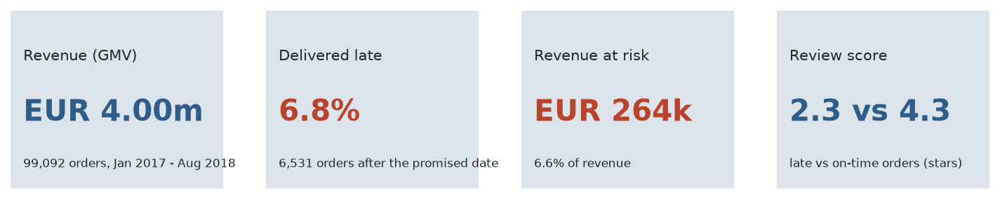
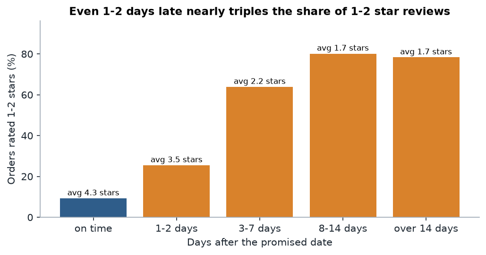
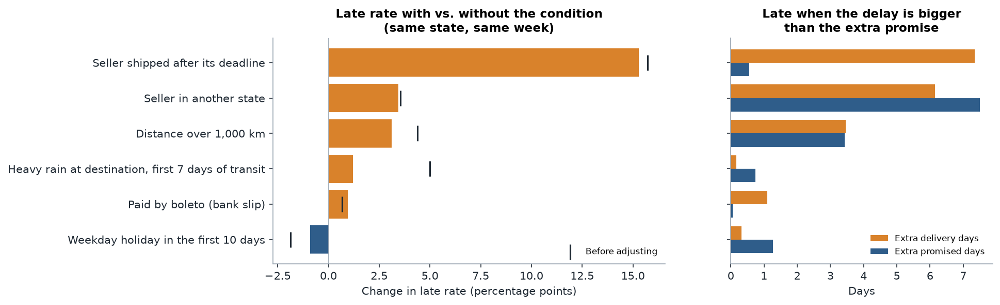
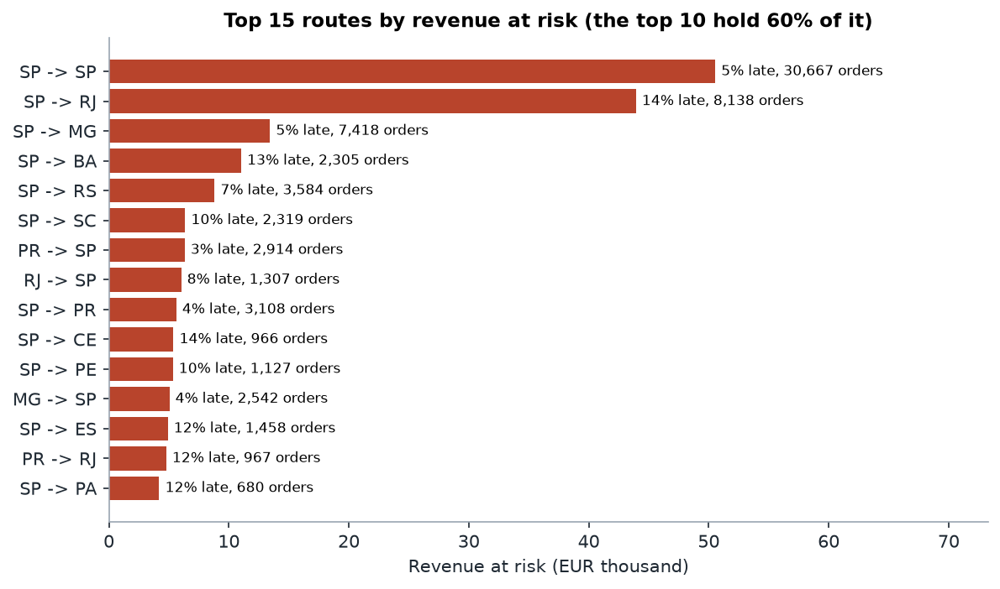
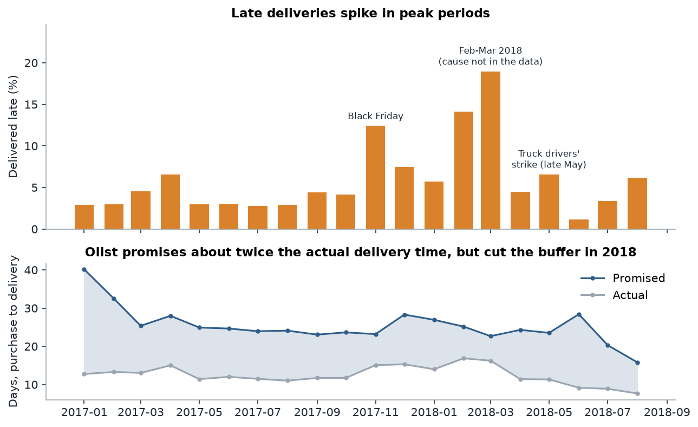
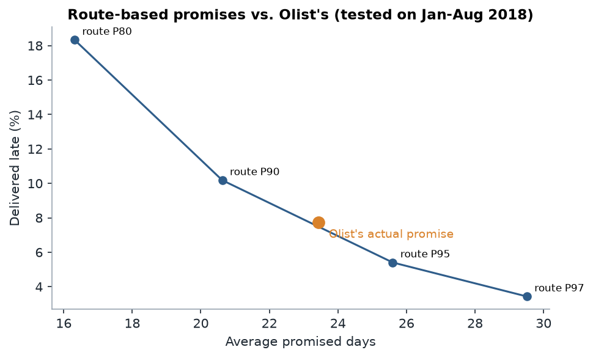

# Findings

Generated by `analysis/findings.py` from the dbt marts. KPI window: orders purchased 1 Jan 2017 to
31 Aug 2018 (the 20 complete months). Money in euros at the ECB rate of each purchase date.

## 1. Headline

| Measure | Value |
|---|---|
| Orders | 99,092 |
| Delivered | 96,203 |
| Delivered late | 6,531 (6.79%) |
| Overdue, never delivered | 1,699 |
| Revenue (GMV) | EUR 4.00m |
| Revenue of late orders | EUR 291k |
| **Revenue at risk** | **EUR 264k (6.6% of GMV)** |
| Average promised vs. actual delivery | 24.3 vs. 12.5 days |

Revenue at risk = orders where the promise was broken **and** there is evidence of damage:

| reason | orders | revenue_at_risk_eur |
|---|---|---|
| Late and rated 1-2 stars | 3,981 | 183,182 |
| Overdue, never delivered | 1,699 | 80,850 |

All outcomes:

| delivery_outcome | orders | gmv_eur |
|---|---|---|
| On time | 89,672 | 3,604,966 |
| Late | 6,531 | 291,463 |
| Overdue, not delivered | 1,699 | 80,850 |
| Cancelled | 1,182 | 26,342 |
| Delivered, date missing | 8 | 325 |

## 2. Late orders lose the customer

| delivery_outcome | reviewed_orders | avg_review | share_low_review |
|---|---|---|---|
| On time | 89,182 | 4.29 | 9.2% |
| Late | 6,378 | 2.27 | 62.4% |
| Overdue, not delivered | 1,613 | 1.80 | 76.1% |

| days_late_band | orders | avg_review | share_low_review |
|---|---|---|---|
| 0: on time | 89,182 | 4.29 | 9.2% |
| 1: 1-2 days | 1,355 | 3.51 | 25.5% |
| 2: 3-7 days | 2,244 | 2.23 | 63.9% |
| 3: 8-14 days | 1,446 | 1.67 | 80.2% |
| 4: over 14 days | 1,333 | 1.72 | 78.3% |

## 3. Where the time goes

Median time per stage (approval in hours, seller and carrier stages in days):

| outcome | median_approval_hours | median_seller_days | median_carrier_days | avg_promised_days |
|---|---|---|---|---|
| On time | 0.3 | 1.8 | 7.0 | 24.4 |
| Late | 0.4 | 3.1 | 26.2 | 23.3 |

Payment approval by main payment type:

| payment_type | delivered_orders | median_approval_hours | p90_approval_hours | late_rate |
|---|---|---|---|---|
| credit_card | 72,612 | 0.3 | 20.9 | 6.7% |
| boleto | 19,140 | 29.1 | 67.2 | 7.3% |
| voucher | 2,970 | 0.3 | 24.2 | 6.1% |
| debit_card | 1,481 | 0.8 | 24.0 | 5.3% |

Whose stage made late orders late:

| late_cause | late_orders | share | late_gmv_eur |
|---|---|---|---|
| After hand-over (carrier or promise) | 4,695 | 71.9% | 196,089 |
| Seller shipped late | 1,811 | 27.7% | 94,346 |
| Unclear (timestamp issue) | 25 | 0.4% | 1,028 |

## 4. What goes with late deliveries

Adjusted = exposed vs. unexposed orders to the same customer state in the same week (rain: same
shipping week). "Extra delivery days" and "extra promised days" are adjusted the same way.

| driver | exposed_orders | share_exposed | late_rate_exposed | late_rate_not_exposed | raw_late_rate_difference | adjusted_late_rate_difference | adjusted_actual_days_difference | adjusted_promised_days_difference |
|---|---|---|---|---|---|---|---|---|
| Seller shipped after its deadline | 8,581 | 8.9% | 21.1% | 5.4% | +15.7% | +15.3% | +7.3 | +0.6 |
| Seller in another state | 61,593 | 64.0% | 8.1% | 4.5% | +3.6% | +3.5% | +6.1 | +7.5 |
| Distance over 1,000 km | 15,301 | 16.0% | 10.5% | 6.1% | +4.4% | +3.1% | +3.5 | +3.4 |
| Heavy rain at destination, first 7 days of transit | 14,425 | 15.0% | 11.0% | 6.0% | +5.0% | +1.2% | +0.2 | +0.7 |
| Paid by boleto (bank slip) | 19,140 | 19.9% | 7.3% | 6.7% | +0.7% | +0.9% | +1.1 | +0.1 |
| Weekday holiday in the first 10 days | 20,764 | 21.6% | 5.3% | 7.2% | -1.9% | -0.9% | +0.3 | +1.3 |

## 5. Routes

The 10 routes with the most revenue at risk hold 60% of it (routes with 30+ delivered orders).

| revenue_at_risk_rank | route | delivered_orders | late_rate | avg_distance_km | avg_promised_days | avg_actual_days | p90_actual_days | revenue_at_risk_eur | cumulative_share_of_revenue_at_risk |
|---|---|---|---|---|---|---|---|---|---|
| 1 | SP -> SP | 30,667 | 4.7% | 150 | 17.9 | 7.9 | 14.0 | 50,542 | 19.1% |
| 2 | SP -> RJ | 8,138 | 14.2% | 441 | 27.0 | 16.2 | 31.0 | 43,931 | 35.8% |
| 3 | SP -> MG | 7,418 | 5.3% | 495 | 24.9 | 12.3 | 21.0 | 13,432 | 40.9% |
| 4 | SP -> BA | 2,305 | 12.9% | 1,389 | 30.5 | 19.7 | 32.0 | 11,024 | 45.0% |
| 5 | SP -> RS | 3,584 | 6.6% | 906 | 30.2 | 16.1 | 27.0 | 8,809 | 48.4% |
| 6 | SP -> SC | 2,319 | 9.6% | 562 | 26.7 | 15.8 | 27.0 | 6,357 | 50.8% |
| 7 | PR -> SP | 2,914 | 3.0% | 470 | 26.1 | 11.0 | 18.0 | 6,311 | 53.2% |
| 8 | RJ -> SP | 1,307 | 7.9% | 403 | 23.2 | 11.7 | 21.0 | 6,022 | 55.5% |
| 9 | SP -> PR | 3,108 | 4.4% | 463 | 25.7 | 12.7 | 21.0 | 5,614 | 57.6% |
| 10 | SP -> CE | 966 | 13.8% | 2,259 | 31.9 | 21.1 | 34.0 | 5,382 | 59.6% |

Highest late rates:

| route | delivered_orders | late_rate | avg_promised_days | avg_actual_days | p90_actual_days | avg_distance_km |
|---|---|---|---|---|---|---|
| PR -> AL | 35 | 31.4% | 34.5 | 29.1 | 48.6 | 2,261 |
| SP -> AL | 255 | 23.9% | 32.9 | 25.0 | 41.0 | 1,896 |
| RJ -> CE | 52 | 21.2% | 30.0 | 25.2 | 37.7 | 2,125 |
| MA -> SP | 123 | 20.3% | 25.9 | 16.1 | 26.8 | 2,331 |
| SP -> MA | 489 | 19.0% | 31.1 | 21.9 | 35.0 | 2,178 |
| PR -> MA | 40 | 17.5% | 31.5 | 22.6 | 33.1 | 2,488 |
| MG -> AL | 35 | 17.1% | 33.7 | 22.0 | 35.0 | 1,518 |
| SP -> PI | 328 | 16.5% | 30.7 | 20.3 | 32.3 | 2,015 |
| SP -> SE | 207 | 16.4% | 30.5 | 21.1 | 35.4 | 1,723 |
| SP -> RR | 32 | 15.6% | 45.4 | 32.3 | 53.9 | 3,248 |

By customer region:

| customer_region | delivered_orders | late_rate | avg_promised_days | avg_actual_days | revenue_at_risk_eur |
|---|---|---|---|---|---|
| Northeast | 9,015 | 12.8% | 31.2 | 19.9 | 39,563 |
| North | 1,791 | 8.6% | 38.1 | 22.5 | 6,163 |
| Central-West | 5,610 | 6.5% | 27.2 | 14.9 | 9,067 |
| Southeast | 66,020 | 6.1% | 22.2 | 10.7 | 108,517 |
| South | 13,767 | 5.9% | 27.0 | 14.0 | 19,872 |

## 6. Sellers

3,068 sellers sold in the KPI window; 625 have 30+ delivered orders.
**54 are on the watchlist** (late rate at least twice the platform's 6.7%):
they handle 4.4% of revenue but 9.2% of revenue at risk.

Top 10 sellers by revenue at risk (mostly large sellers with ordinary late rates: volume, not failure):

| rank | seller | state | delivered_orders | late_rate | missed_ship_by_rate | avg_review_score | revenue_at_risk_eur | watchlist |
|---|---|---|---|---|---|---|---|---|
| 1 | 4a3ca931 | SP | 1,772 | 9.7% | 8.7% | 3.83 | 5,232 | no |
| 2 | 4869f7a5 | SP | 1,124 | 10.5% | 5.5% | 4.13 | 4,917 | no |
| 3 | 7c67e144 | SP | 973 | 9.1% | 29.6% | 3.49 | 4,256 | no |
| 4 | 7e93a43e | SP | 318 | 4.7% | 7.4% | 4.21 | 3,869 | no |
| 5 | 7d13fca1 | SP | 558 | 11.5% | 14.9% | 4.02 | 3,391 | no |
| 6 | fa1c13f2 | SP | 578 | 9.2% | 8.1% | 4.34 | 2,889 | no |
| 7 | 53243585 | BA | 348 | 3.4% | 6.8% | 4.13 | 2,740 | no |
| 8 | 46dc3b2c | RJ | 494 | 5.9% | 9.6% | 4.21 | 2,694 | no |
| 9 | 1025f0e2 | SP | 910 | 7.9% | 17.7% | 3.99 | 2,465 | no |
| 10 | 955fee92 | SP | 1,261 | 6.1% | 0.7% | 4.16 | 2,395 | no |

Top 10 watchlist sellers by revenue at risk (the ones to call first):

| seller | state | delivered_orders | late_rate | missed_ship_by_rate | avg_review_score | gmv_eur | revenue_at_risk_eur |
|---|---|---|---|---|---|---|---|
| 712e6ed8 | SC | 77 | 20.8% | 19.0% | 3.38 | 12,172 | 1,809 |
| 81602554 | SP | 380 | 13.7% | 24.9% | 3.93 | 13,573 | 1,536 |
| f7ba60f8 | SP | 218 | 13.8% | 0.9% | 4.21 | 17,635 | 1,322 |
| 88460e8e | PR | 246 | 17.1% | 47.6% | 3.41 | 8,852 | 1,263 |
| 06a2c3af | MA | 389 | 19.0% | 31.4% | 3.99 | 11,197 | 1,120 |
| 54965bbe | PR | 73 | 30.1% | 53.9% | 3.00 | 3,304 | 1,066 |
| ea566164 | SP | 50 | 18.0% | 8.0% | 3.78 | 2,764 | 1,056 |
| c60b801f | SP | 39 | 15.4% | 40.0% | 3.32 | 3,271 | 885 |
| 1ca7077d | SP | 108 | 16.7% | 52.6% | 2.33 | 3,814 | 854 |
| cd68562d | SP | 122 | 15.6% | 14.8% | 3.94 | 5,517 | 840 |

## 7. Month by month

| month_start | delivered_orders | late_rate | late_rate_rolling_3m | gmv_eur | revenue_at_risk_eur | avg_promised_days | avg_actual_days | avg_review_score |
|---|---|---|---|---|---|---|---|---|
| 2017-01 | 750 | 2.9% | 2.9% | 40,482 | 3,653 | 40.2 | 12.8 | 4.06 |
| 2017-02 | 1,653 | 3.0% | 3.0% | 86,498 | 5,164 | 32.5 | 13.3 | 4.02 |
| 2017-03 | 2,546 | 4.6% | 3.8% | 129,242 | 6,522 | 25.4 | 13.0 | 4.07 |
| 2017-04 | 2,303 | 6.6% | 4.9% | 122,547 | 10,479 | 28.0 | 15.0 | 4.04 |
| 2017-05 | 3,545 | 3.0% | 4.4% | 165,282 | 6,878 | 24.9 | 11.4 | 4.14 |
| 2017-06 | 3,135 | 3.0% | 3.9% | 136,452 | 8,426 | 24.7 | 12.0 | 4.15 |
| 2017-07 | 3,872 | 2.8% | 2.9% | 158,392 | 7,405 | 24.0 | 11.5 | 4.18 |
| 2017-08 | 4,193 | 2.9% | 2.9% | 179,541 | 7,214 | 24.1 | 11.0 | 4.24 |
| 2017-09 | 4,150 | 4.4% | 3.4% | 192,930 | 8,846 | 23.1 | 11.7 | 4.19 |
| 2017-10 | 4,478 | 4.2% | 3.8% | 205,150 | 7,844 | 23.7 | 11.7 | 4.12 |
| 2017-11 | 7,288 | 12.4% | 8.0% | 307,880 | 29,987 | 23.2 | 15.1 | 3.91 |
| 2017-12 | 5,513 | 7.5% | 8.7% | 222,051 | 20,738 | 28.3 | 15.3 | 4.02 |
| 2018-01 | 7,069 | 5.7% | 8.6% | 282,804 | 19,974 | 26.9 | 14.0 | 4.04 |
| 2018-02 | 6,555 | 14.1% | 9.1% | 246,181 | 29,822 | 25.2 | 16.9 | 3.83 |
| 2018-03 | 7,003 | 19.0% | 12.9% | 285,792 | 45,054 | 22.7 | 16.2 | 3.75 |
| 2018-04 | 6,798 | 4.5% | 12.6% | 277,837 | 14,142 | 24.3 | 11.4 | 4.16 |
| 2018-05 | 6,749 | 6.6% | 10.1% | 268,667 | 12,802 | 23.5 | 11.3 | 4.19 |
| 2018-06 | 6,096 | 1.2% | 4.2% | 232,130 | 4,229 | 28.4 | 9.2 | 4.28 |
| 2018-07 | 6,156 | 3.4% | 3.8% | 237,274 | 6,581 | 20.3 | 8.9 | 4.26 |
| 2018-08 | 6,351 | 6.2% | 3.6% | 226,815 | 8,273 | 15.8 | 7.7 | 4.26 |

## 8. Would route-based promises do better?

Each route's promise set to a percentile of its 2017 delivery times (fallback: customer state, then
all orders), tested on Jan-Aug 2018 orders against Olist's actual promises.

| percentile | orders | current_avg_promise_days | current_late_rate | proposed_avg_promise_days | proposed_late_rate |
|---|---|---|---|---|---|
| 80% | 52,777 | 23.4 | 7.7% | 16.3 | 18.3% |
| 90% | 52,777 | 23.4 | 7.7% | 20.6 | 10.2% |
| 95% | 52,777 | 23.4 | 7.7% | 25.6 | 5.4% |
| 97% | 52,777 | 23.4 | 7.7% | 29.5 | 3.4% |

